<p align="center">
  
</p>
<div align="center">   

  # S2R-Bench: A Sim-to-Real Evaluation Benchmark for Autonomous Driving 
</div> 

<div align="justify">  

This is the official repository of [**S2R-Bench**](https://arxiv.org). 

<div align=center>

<p align="center"><font face="Helvetica" size=3.><b>Data collection vehicle </b></font></p>
</div>

</div>

# News
<strong>[2025.6.15]  Our Paper has been submitted to Nature Portfolio journal !</strong>

[2024.12.31]  Our code and data has been maintained and will be released soon ! 

# 1. Introduction
<p style=""text-align:justify; text-justify:interideograph;">
The S2R-Bench were conducted during December 2023 in Beijing, China. We specially select a variety of road conditions such as city roads, suburban roads, motorways, tunnels, towns, villages, communities, campuses, etc., covering roads covering about 700 km. In addition, we collect data during daytime and nighttime separately to ensure data diversity and84provide a benchmark for in-depth study of sensor anomalies in real-world scenarios.
</p>

### Sensor Configuration 

The configuration of our ego vehicle and the coordinate relationships between the multiple sensors are shown in Fig. 1 (a). The ego vehicle system platform consists of a high-resolution camera, an 80-line LiDAR, and two types of 4D radar. The sensor configurations are detailed in Table 1.

<div align=center>
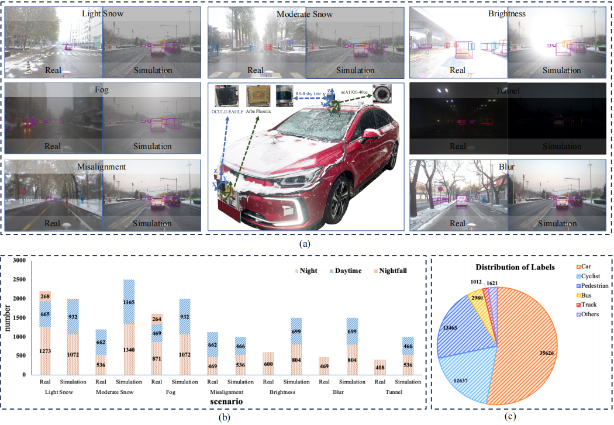
</div>
<p align="center"><font face="Helvetica" size=3.><b>Figure 2. The configuration of our experiment platform and visualisation scenarios.</b> (a) Shows the self-driving car system as well as the real anomaly data
collected and the simulated anomaly data. (b) shows the statistics of the number of frames for various periods in different scenarios. (c) shows the statistics
of the number of objects in different labels. The result suggests that the main labels like Car, Pedestrian, and Cyclist take up over three-quarters of the total
amount of objects.</font></p>


* The LiDAR sensor has an accuracy of 0.2° in azimuth and 0.2° in elevation. It collects data in a 360° horizontal field of view and a 40° vertical field of view. Since we are only concerned with the range in front of the vehicle, we retain data within a 120° field of view for labeling purposes. The Occuli radar sensor, when in long-range mode,78captures data within a 113° horizontal and 25° vertical field of view. The Arbe Phoenix radar, in middle-range mode, collects data within a 30° vertical field of view. The detailed specifications of the sensors are provided in Table 1. 

<div align=center>
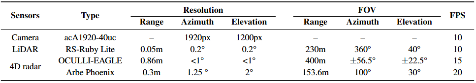
</div>
<p align="center"><font face="Helvetica" size=3.><b>Table 1. The configuration of the autonomous vehicle system platform</b></font></p>

<div align=center>
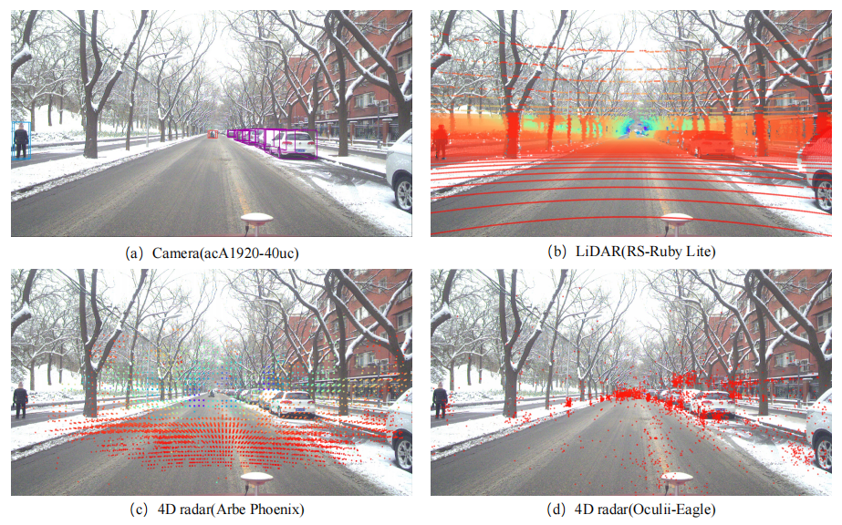
</div>
<p align="center"><font face="Helvetica" size=3.><b>Figure 3. Projection visualization of sensor calibration. (a), (b), (c), and (d) represent the projection of the calibrated data (3D bounding box, LiDAR point
cloud, Arbe Phoenix point cloud, and Oculli-Eagle point cloud) on the image.</b></font></p>

# 2. Data Acquisition Scenario

* Collect non ideal driving conditions in 10 scenarios to verify the robustness and safety of the model in various scenarios.
<div align=center>
<table class="table-noborder" align=center>
  <tr>
    <td align="center">
      <figure>
        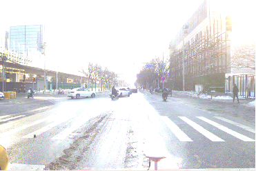
      </figure>
      <p align="center"><font face="Helvetica" size=2.><b>a)  Urban roads</b></font></p>
    </td>
    <td align="center">
      <figure>
        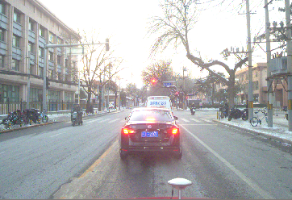
      </figure>
      <p align="center"><font face="Helvetica" size=2.><b>b)  Suburban roads</b></font></p>
    </td>
    <td align="center">
      <figure>
        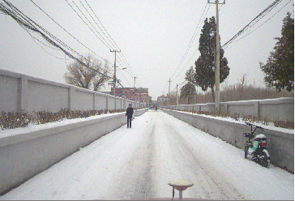
      </figure>
      <p align="center"><font face="Helvetica" size=2.><b>c)  villages</b></font></p>
    </td>
  </tr>
  <tr>
    <td align="center">
      <figure>
        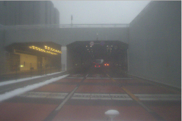
      </figure>
      <p align="center"><font face="Helvetica" size=2.><b>d)  Tunnels</b></font></p>
    </td>
    <td align="center">
      <figure>
        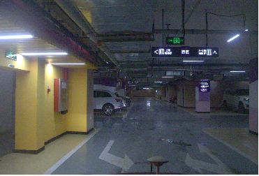
      </figure>
      <p align="center"><font face="Helvetica" size=2.><b>e)  Underground parking</b></font></p>
    </td>
    <td align="center">
      <figure>
        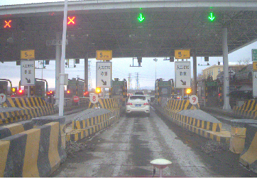
      </figure>
      <p align="center"><font face="Helvetica" size=2.><b>f)  Highways</b></font></p>
    </td>
  </tr>
  <tr>
    <td align="center">
      <figure>
        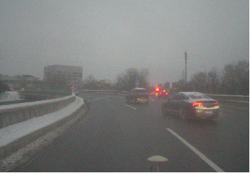
      </figure>
      <p align="center"><font face="Helvetica" size=2.><b>g)  Roundabouts</b></font></p>
    </td>
    <td align="center">
      <figure>
        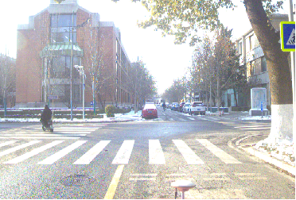
      </figure>
      <p align="center"><font face="Helvetica" size=2.><b>h)  Campuses</b></font></p>
    </td>
    <td align="center">
      <figure>
        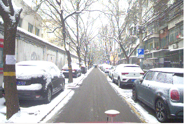
      </figure>
      <p align="center"><font face="Helvetica" size=2.><b>i)  Communities</b></font></p>
    </td>
  </tr>
  <tr>
    <td align="center">
      <figure>
        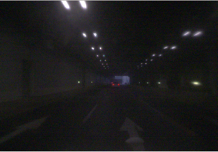
      </figure>
      <p align="center"><font face="Helvetica" size=2.><b>j)  Tunnels</b></font></p>
    </td>
    <td align="center">
      <figure>
        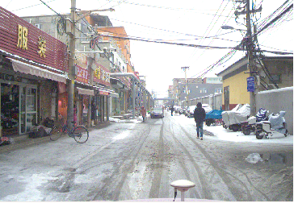
      </figure>
      <p align="center"><font face="Helvetica" size=2.><b>k)  Towns</b></font></p>
    </td>
    <td align="center">
      <figure>
        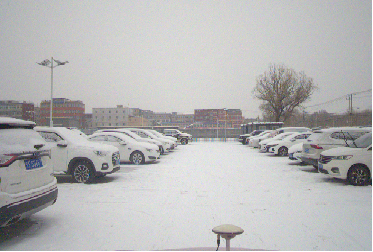
      </figure>
      <p align="center"><font face="Helvetica" size=2.><b>l)  Parking</b></font></p>
    </td>
  </tr>
</table>
<p align="center"><font face="Helvetica" size=3.><b>Figure 3. Collect non ideal driving conditions in 10 scenarios to verify the robustness and safety of the model in various scenarios.</font></p>
</div>

<div align=left>

</div>
<p  align="left"><font face="Helvetica" size=3.><b>Figure 4. Representing 3D annotations in multiple scenarios and sensor modalities. The four columns respectively display the
projection of 3D annotation boxes in images, LiDAR point clouds, Arbe Phoenix and OCULII-EAGLE radar point clouds. Each row represents a scenario type. (a) light snow & real; (b) light snow & simulation; (c) moderate snow & real; (d) moderate snow & simulation; (e) fog & real; (f) fog & simulation; (g) brightness & real; (h) brightness & simulation.
</font></p>

<a id="downloadlink"></a>
# 3. Download Link
* Our dataset is freely available to researchers. Please download and sign our [agreement](https://drive.google.com/file/d/1Da3Rvf78989b2-PQKDbHsMb5wUIz3FUp/view?usp=sharing
) and send it to the provided email address (<b>lwang_hit@hotmail.com</b>). You will receive the download link within one week.
# 4. The Description of Calib Format

* The calib.txt contains tree parts. The dataset consists of two parts: the data part and the alignment calibration file. The data part is image data in png format and point cloud data in bin format. The alignment calibration file includes calibration parameters for the four sensors. The camera-LiDAR, camera-4D radar joint calibration are shown here as examples for illustration.
```
   S2R-Bench_cam.Intrinsics.RadialDistortion: Barrel distortion of Dual Radar_cam [ k1, k2, k3 ]
   S2R-Bench_cam.Intrinsics.TangentialDistortion: radial distortion of Dual Radar_cam [ p1, p2 ]
   S2R-Bench_cam.IntrinsicMatrix: Dual Radar_cam's intrinsic matrix [ af, 0, 0; 0, bf, 0; u, v, 1]
   S2R-Bench_LiDAR-->Dual Radar_cam: Dual Radar_lidar to Dual Radar cam's single response matrix P(4×4)
   S2R-Bench_radar--> Dual Radar_cam: Dual Radar_radar to Dual Radar_cam rotation matrix + translation matrix P(3×4)
```
# 5. Label Files Discription
* <b>All values (numerical or strings) are separated via spaces, each row corresponds to one object. The 19 columns represent:</b>
```
  Value       Name             Description
  -------------------------------------------------------------------------------------------------------
  1        type               Describes the type of object: 'Car', 'Van', 'Truck', 'Pedestrian',  'Person_sitting', 'Cyclist', 'Tram', 'Misc' or 'DonCare'
  1        truncated          Float from 0 (non-truncated) to 1 (truncated), where truncated refers to the object leaving image boundaries
  1        occluded           Integer (0,1,2,3) indicating occlusion state: 0 = fully visible, 1 = partly ccluded, 2 = largely occluded, 3 = unknown
  1        alpha              Observation angle of object, ranging [-pi..pi]
  4        bbox               2D bounding box of object in the image (0-based index): contains left, top, right, bottom pixel coordinates. 
  3        dimensions         3D object dimensions: height, width, length (in meters).
  3        location           3D object location x,y,z in camera coordinates (in meters).
  1        rotation_y         Rotation ry around Y-axis in camera coordinates [-pi..pi].
  1        score              Only for results: Float,indicating confidence in detection, needed for p/r curves , higher is better.
  1        track_id           Path tracking of the same object
 ```
* Since the labeling work is done in label coordinate, the bounding box out of the image FOV(1920×1080) needs to be cut.

# 6. Data Statistics
<div align=center>
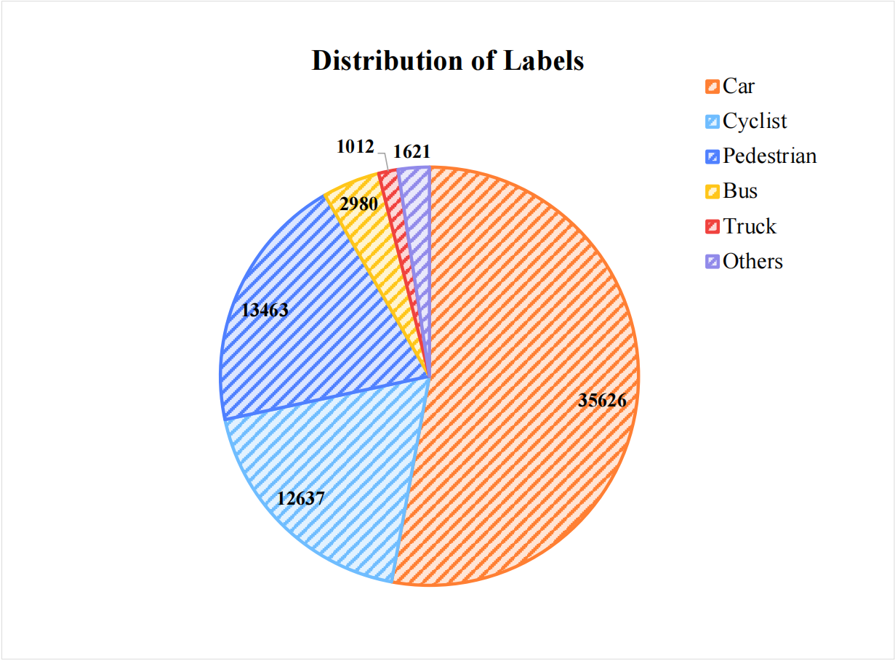
</div>
<p align="center"><font face="Helvetica" size=3.><b>Figure 6. The statistics of the number of objects in different labels. The result suggests that the main labels like Car,
Pedestrian, and Cyclist take up over three-quarters of the total amount of objects.</b></font></p>

* We performed a118statistical analysis of the 9981 frames of labeled data, counting the number of objects in each label category, as shown in Fig 5.A pie chart illustrates the counts of objects in the top six labeled categories, with the "others" category primarily consisting of tricycles. As shown in the figure, the majority of labels are concentrated in the categories of "car", "pedestrian", and "cyclist", accounting for approximately 53%, 20%, and 19%, respectively.

<div align=center>
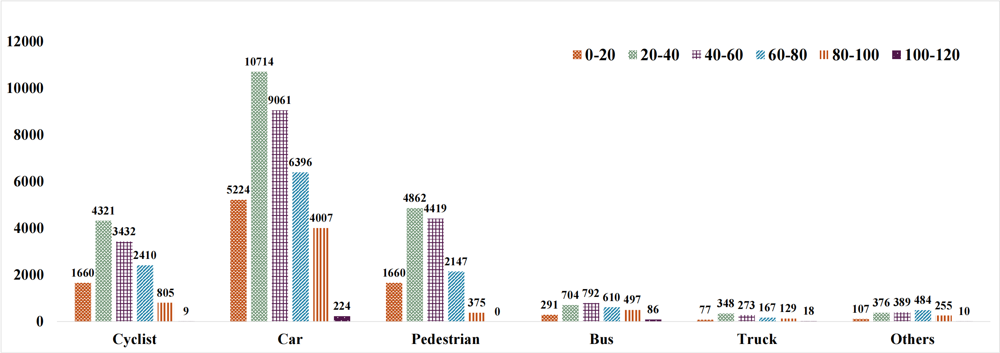
</div>
<p align="center"><font face="Helvetica" size=3.><b>Figure 7. The statistic of different annotated objects at different ranges of distance from the ego vehicle. From the results,
the majority of the annotated objects are in the range of 20m-80m.</b></font></p>

* We also conduct a statistical analysis of the number of objects with each label at different distance ranges from our vehicle, as shown in Figure 7. Most objects are within 60 meters of our ego vehicle. 

# 7. Using simulation methods to generate simulated dataset
We store the simulation methods in the "simulation method" folder, which enable adding various environmental perturbations or noise to sensor data (LiDAR, 4D radar, and images) to generate datasets simulating unobserved real-world conditions (e.g., adverse weather like rain, snow, or fog). Below are the specific methods and their functionalities:
### 3D_Corruptions_AD
Provides simulation interfaces for LiDAR, 4D radar, and images, with perturbation intensity controlled  severity levels.
* LiDAR and 4D radar simulation method. The following method is an example of simulating a Spatial Misalignment scene:
```bash
lidar = np.array([N,4])
from .LiDAR_corruptions import rain_sim, snow_sim, fog_sim
lidar_cor = rain_sim(lidar, severity)

from .LiDAR_corruptions import gaussian_noise_bbox
bbox = results['ann_info']['gt_bboxes_3d']
lidar_cor = gaussian_noise_bbox(lidar, severity,bbox)
from .LiDAR_corruptions import temporal_alignment_noise
noise_pose = spatial_alignment_noise(ori_pose, severity)
```
* Image simulation method. The following method is an example of simulating a snow scene:
```bash
from .Camera_corruptions import ImageAddSnow,ImageAddFog,ImageAddRain
snow_sim = ImageAddSnow(severity, seed=2022)
img_bgr_255_np_uint8 = results['img'] # the img in mmdet3d loading pipeline
img_rgb_255_np_uint8 = img_bgr_255_np_uint8[:,:,[2,1,0]]
image_aug_rgb = snow_sim(
    image=img_rgb_255_np_uint8
    )
image_aug_bgr = image_aug_rgb[:,:,[2,1,0]]
results['img'] = image_aug_bgr

from .Camera_corruptions import ImageBBoxOperation
bbox_shear = ImageBBoxOperation(severity)
img_bgr_255_np_uint8 = results['img']
bboxes_corners = results['gt_bboxes_3d'].corners
bboxes_centers = results['gt_bboxes_3d'].center
lidar2img = results['lidar2img'] 
img_rgb_255_np_uint8 = img_bgr_255_np_uint8[:, :, [2, 1, 0]]
c = [0.05, 0.1, 0.15, 0.2, 0.25][bbox_shear.severity - 1]
b = np.random.uniform(c - 0.05, c + 0.05) * np.random.choice([-1, 1])
d = np.random.uniform(c - 0.05, c + 0.05) * np.random.choice([-1, 1])
e = np.random.uniform(c - 0.05, c + 0.05) * np.random.choice([-1, 1])
f = np.random.uniform(c - 0.05, c + 0.05) * np.random.choice([-1, 1])
transform_matrix = torch.tensor([
    [1, 0, b],
    [d, 1, e],
    [f, 0, 1]
]).float()

image_aug_rgb = bbox_shear(
    image=img_rgb_255_np_uint8,
    bboxes_centers=bboxes_centers,
    bboxes_corners=bboxes_corners,
    transform_matrix=transform_matrix,
    lidar2img=lidar2img,
)
image_aug_bgr = image_aug_rgb[:, :, [2, 1, 0]]
results['img'] = image_aug_bgr
```
### MultiCorrupt
* LiDAR and 4D radar simulation method. The following method is an example of simulating a snow scene:
```bash
python3 converter/lidar_converter.py \
    --corruption snow \
    --root_folder /workspace/data/nuscenes \
    --dst_folder /workspace/multicorrupt/snow/3/ \
    --severity 3 \
    --n_cpus 64 \
    --sweep true
```
* Image simulation method. The following method is an example of simulating a snow scene:
```bash
python converter/img_converter.py \
    --corruption snow \
    --root_folder /workspace/data/nuscenes \
    --dst_folder /workspace/multicorrupt/snow/3 \
    --severity 3 \
    --n_cpus 24
```
### Robo3d
* LiDAR and 4D radar simulation method. The following method is an example of simulating a snow scene:
```bash
python simulation.py \
    --root_folder ./data_root/Kitti \
    --dst_folder  ./save_root/snow/light \
    --snowfall_rate  0.5  \
    --terminal_velocity  2.0   \
```

### RoboDepth
A simulation tool for image depth estimation tasks. The following method is an example of simulating a foggy scene：
```bash
python corruptions/create.py 
    --image_list splits/eigen.txt  
    --if_fog
```


# 8. Getting Started

### Environment
This is the documentation for how to use our detection frameworks with Dual-Radar dataset.
We test the Dual-Radar detection frameworks on the following environment:

* Python 3.8.16 (3.10+ does not support open3d.)
* Ubuntu 18.04/20.04
* Torch 1.10.1+cu113
* CUDA 11.3
* opencv 4.2.0.32

### Requirements

* Clone the repository

```
 git clone https://github.com/adept-thu/****.git
 cd ****
```

* Create a conda environment
```
conda create -n Dual-Radardet python=3.8.16
conda activate Dual-Radardet
```

* Install PyTorch (We recommend pytorch 1.10.1.)

* Install the dependencies
```
pip install -r requirements.txt
```
* Install Spconv（our cuda version is 113）
```
pip install spconv-cu113
```
* Build packages for Dual-Radardet
```
python setup.py develop
```
### Quick Demo
Here we provide a quick demo to test a pretrained model on the custom point cloud data and visualize the predicted results
* Download the pretrained model as shown in Table 4~8.
* Make sure you have installed the Open3d and mayavi visualization tools. If not, you could install it as follow: 
```
pip install open3d
pip install mayavi
```
* prepare your point cloud data
```
points[:, 3] = 0 
np.save(`my_data.npy`, points)
```
* Run the demo with a pretrained model and  point cloud data as follows
```
python demo.py --cfg_file ${CONFIG_FILE} \
    --ckpt ${CKPT} \
    --data_path ${POINT_CLOUD_DATA}
```
# 8. Results
<div align=left>
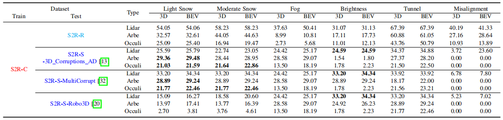
</div>
<p  align="left">THE COMPARISON OF THE “CAR” CATEGORY WITH THE POINTPILLARS MODEL AT MEDIUM DIFFICULTY USING "S2R-C".</p>

<div align=left>
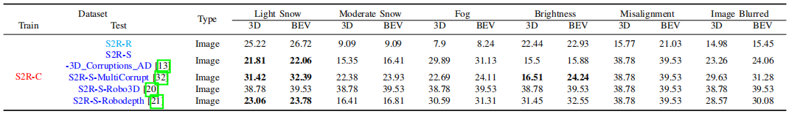
</div>
<p  align="left">THE COMPARISON OF THE “CAR” CATEGORY WITH THE SMOKE MODEL AT MEDIUM DIFFICULTY USING “S2R-C”.</p>

<div align=left>
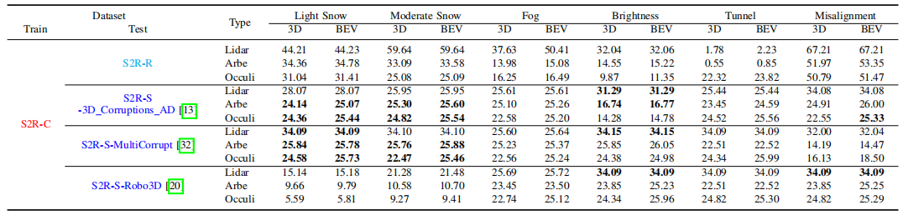
</div>
<p  align="left">THE COMPARISON OF THE “CAR” CATEGORY WITH THE FOCALS CONV MODEL AT MEDIUM DIFFICULTY USING S2R-C.</p>


<div align=left>
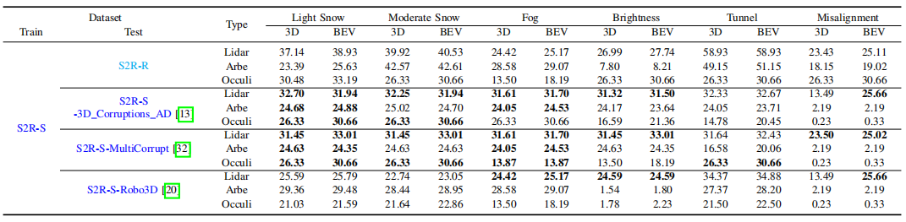
</div>
<p  align="left">THE COMPARISON OF THE “CAR” CATEGORY WITH THE POINTPILLARS MODEL AT MEDIUM DIFFICULTY USING SIMULATED-DATASET.</p>

# 9. Model Zoo

<table>

<tr>

<th>Model</th>

<th>Train Type</th>

<th>Data Type</th>

<th>ckpt</th>

</tr>

<tr>

<td></td>

<td>S2R-C</td>

<td>LiDAR</td>

<td><a href="https://pan.baidu.com/s/1pp8my4LgC_sTQydGu2xyAw?pwd=8888">link</a></td>

</tr>

<tr>

<td></td>

<td>S2R-C</td>

<td>Arbe</td>

<td><a href="https://pan.baidu.com/s/1pp8my4LgC_sTQydGu2xyAw?pwd=8888">link</a></td>

</tr>

<tr>

<td></td>

<td>S2R-C</td>

<td>ARS548</td>

<td><a href="https://pan.baidu.com/s/1pp8my4LgC_sTQydGu2xyAw?pwd=8888">link</a></td>

</tr>

<tr>

<td></td>

<td>S2R-S</td>

<td>LiDAR</td>

<td><a href="https://pan.baidu.com/s/1pp8my4LgC_sTQydGu2xyAw?pwd=8888">link</a></td>

</tr>

<tr>

<td>PointPillar</td>

<td>S2R-S</td>

<td>Arbe</td>

<td><a href="https://pan.baidu.com/s/1pp8my4LgC_sTQydGu2xyAw?pwd=8888">link</a></td>

</tr>

<tr>

<td></td>

<td>S2R-S</td>

<td>ARS548</td>

<td><a href="https://pan.baidu.com/s/1pp8my4LgC_sTQydGu2xyAw?pwd=8888">link</a></td>

</tr>

<tr>

<td></td>

<td>S2R-R</td>

<td>LiDAR</td>

<td><a href="https://pan.baidu.com/s/1pp8my4LgC_sTQydGu2xyAw?pwd=8888">link</a></td>

</tr>

<tr>

<td></td>

<td>S2R-R</td>

<td>Arbe</td>

<td><a href="https://pan.baidu.com/s/1pp8my4LgC_sTQydGu2xyAw?pwd=8888">link</a></td>

</tr>

<tr>

<td></td>

<td>S2R-R</td>

<td>ARS548</td>

<td><a href="https://pan.baidu.com/s/1pp8my4LgC_sTQydGu2xyAw?pwd=8888">link</a></td>

</tr>
<tr>

<td></td>

<td>S2R-C</td>

<td>LiDAR</td>

<td><a href="https://pan.baidu.com/s/1pp8my4LgC_sTQydGu2xyAw?pwd=8888">link</a></td>

</tr>

<tr>

<td></td>

<td>S2R-C</td>

<td>Arbe</td>

<td><a href="https://pan.baidu.com/s/1pp8my4LgC_sTQydGu2xyAw?pwd=8888">link</a></td>

</tr>

<tr>

<td></td>

<td>S2R-C</td>

<td>ARS548</td>

<td><a href="https://pan.baidu.com/s/1pp8my4LgC_sTQydGu2xyAw?pwd=8888">link</a></td>

</tr>

<tr>

<td></td>

<td>S2R-S</td>

<td>LiDAR</td>

<td><a href="https://pan.baidu.com/s/1pp8my4LgC_sTQydGu2xyAw?pwd=8888">link</a></td>

</tr>

<tr>

<td>Focals-Conv</td>

<td>S2R-S</td>

<td>Arbe</td>

<td><a href="https://pan.baidu.com/s/1pp8my4LgC_sTQydGu2xyAw?pwd=8888">link</a></td>

</tr>

<tr>

<td></td>

<td>S2R-S</td>

<td>ARS548</td>

<td><a href="https://pan.baidu.com/s/1pp8my4LgC_sTQydGu2xyAw?pwd=8888">link</a></td>

</tr>

<tr>

<td></td>

<td>S2R-R</td>

<td>LiDAR</td>

<td><a href="https://pan.baidu.com/s/1pp8my4LgC_sTQydGu2xyAw?pwd=8888">link</a></td>

</tr>

<tr>

<td></td>

<td>S2R-R</td>

<td>Arbe</td>

<td><a href="https://pan.baidu.com/s/1pp8my4LgC_sTQydGu2xyAw?pwd=8888">link</a></td>

</tr>

<tr>

<td></td>

<td>S2R-R</td>

<td>ARS548</td>

<td><a href="https://pan.baidu.com/s/1pp8my4LgC_sTQydGu2xyAw?pwd=8888">link</a></td>

</tr>

</table>

# 9. Acknowledgement
* Thanks for the sensor support provided by Beijing Jingwei Hirain Technologies Co., Inc.
# 10. Citation
```
@misc{wang2025s2rbenchsimtorealevaluationbenchmark,
      title={S2R-Bench: A Sim-to-Real Evaluation Benchmark for Autonomous Driving}, 
      author={Li Wang and Guangqi Yang and Lei Yang and Ziying Song and Xinyu Zhang and Ying Chen and Lin Liu and Junjie Gao and Zhiwei Li and Qingshan Yang and Jun Li and Liangliang Wang and Wenhao Yu and Bin Xu and Weida Wang and Huaping Liu},
      year={2025},
      eprint={2505.18631},
      archivePrefix={arXiv},
      primaryClass={cs.RO},
      url={https://arxiv.org/abs/2505.18631}, 
}
```
